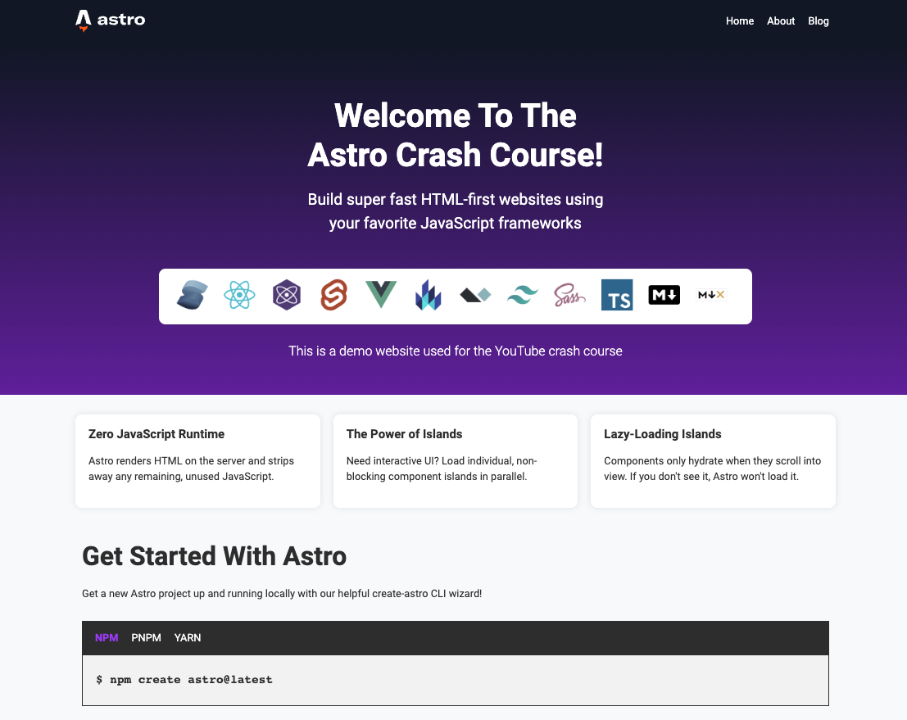

<!-- HEADER -->
<div align="center">
  <h3 align="center">Astro Crash Course</h3>
</div>

<div align="center">
<a href="https://github.com/ayush-lal/astro-crash-course/graphs/contributors">

</a>
<a href="https://github.com/ayush-lal/astro-crash-course/network/members">

</a>
<a href="https://github.com/ayush-lal/astro-crash-course/stargazers">

</a>
<a href="https://github.com/ayush-lal/astro-crash-course/issues">

</a>
</div>

<hr>

## Description

Following [Brad Traversy's Youtube Course](https://www.youtube.com/watch?v=Oi9z5gfIHJs) on Astro to get a better practical understanding.



### Tech Stack

- Astro

## Getting Started

### Installation

Clone the repo

```sh
git clone https://github.com/ayush-lal/astro-crash-course.git
```

Navigate to the root of the repo

```sh
npm install
```

### Usage

| Command                | Action                                                         |
| :--------------------- | :------------------------------------------------------------- |
| `npm install`          | Installs dependencies                                          |
| `npm run dev`          | Starts local dev server at `localhost:3000/astro-crash-course` |
| `npm run build`        | Build your production site to `./dist/`                        |
| `npm run preview`      | Preview your build locally, before deploying                   |
| `npm run astro ...`    | Run CLI commands like `astro add`, `astro check`               |
| `npm run astro --help` | Get help using the Astro CLI                                   |

## Contributing

Contributions are what make the open source community such an amazing place to learn, inspire, and create. Any contributions you make are **greatly appreciated!**

If you have a suggestion that would make this project better, please fork the repo and create a pull request. You can also simply open an issue with the tag "enhancement".
Don't forget to give the project a star!

1. Fork the Project
2. Create your Feature Branch (`git checkout -b feature/AmazingFeature`)
3. Commit your Changes (`git commit -m 'Add some AmazingFeature'`)
4. Push to the Branch (`git push origin feature/AmazingFeature`)
5. Open a Pull Request

## Authors

Ayush Lal - ayush.lal@outlook.com

## License

Distributed under the MIT License. See `LICENSE.txt` for more information.

## Acknowledgments

- [Brad Traversy's Youtube Course](https://www.youtube.com/watch?v=Oi9z5gfIHJs)
